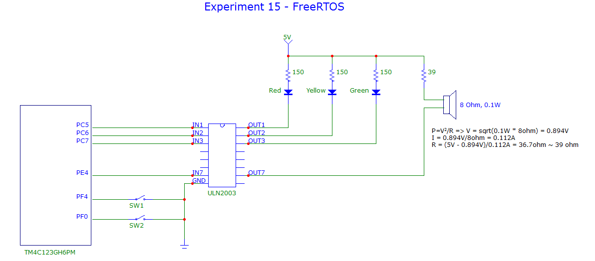

# Experiment15-FreeRTOS

## Overview
This experiment tries out FreeRTOS on the TM4C123 board, as well as GPIO interrupts and playing musical sounds using PWM.  The goal was to create some periodic tasks and preempt them aperiodically, to see if they suffered any noticeable jitter.

The firmware application creates three tasks that blink red, green, and yellow LEDs at different periods, while another task plays a musical sequence on the speaker when one of the onboard switches is pressed .  The tasks controlling the LEDs all have the same (lowest) priority, whereas the task that plays the sounds runs at a higher priority, and this effectively preempts the other tasks each time a note is played.  An ISR, which runs on the falling edge of one of the switches, "gives" a binary semaphore that the high priority task "takes".  Hence, the ISR defers control to a task rather than do the processing itself.

The hardware circuit uses a ULN2003 Darlington array that acts as a low-side driver, sinking current for the LEDs and speaker.  A PWM output drives the speaker at different frequencies to create the musical notes.

 
[Watch the video](https://youtu.be/h58GzA-6aEo)

  