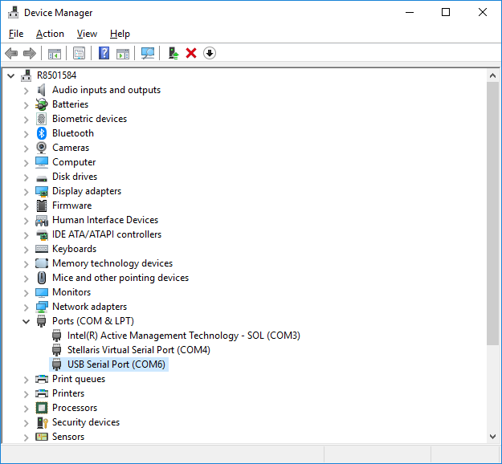
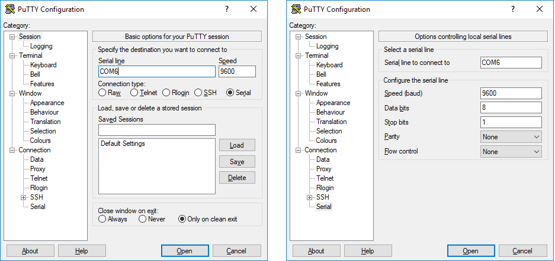

# Experiment5-UART

## Overview
This experiment sets up UART5 on the Tiva board and connects to the PC using an FTDI RS-232 to 3.3v converter cable. The embedded application transmits a selection menu to the PC that allows the user to choose one of eight colors to display on the tri-color LED. PuTTY is used as the terminal program on the PC. 

A scope probe was hooked up to the TX pin (PE5) to view the waveform of the characters transmitted from the board. To see a more regular, periodic signal, the embedded app transmits the letter 'U' repeatedly when SW1 is held down and a menu selection is made. This appears on the oscilloscope as a series of alternating pulses.

 
[Watch the video](https://youtu.be/AObu1TXMY2k)

## Circuit
This experiment uses the TTL-232R-3V3-WE USB to TTL serial cable (wire end version) made by FTDI Chip.  The data sheet is available on FTDI's web site, currently:  https://www.ftdichip.com/Support/Documents/DataSheets/Cables/DS_TTL-232R_CABLES.pdf.  The cable costs around $17 (US) and can be found on Amazon, Mouser, etc.  It is available with or without a header on the wire ends.   

The circuit diagram below shows the connections between the Tiva board and the cable wire ends.

  

The wire ends are stuck directly into the holes of the breadboard.  Only the GND (Black), TXD (Orange), and RXD (Yellow) wires are used.  The remaining wires (CTS, VCC, and RTS) are left unnconnected.  Jumper wires are brought out from the PE4, PE5, and GND pins of the Tiva to make straight though connections with the cable wires.  With RS232, the TXD (transmit) wire from the Host PC is connected to the RX (receive) pin of the Tiva board; and the RXD (receive) wire from the Host PC is connected to the TX (transmit) pin of the board.

On Windows 10, the FTDI cable will be configured as a virtual COM port when it is plugged in.  To determine which COM port is chosen, open the Windows Device Manager and look under the Ports (COM & LPT) node to find the COM number for USB Serial Port when it's plugged in (e.g. COM6):

  

PuTTY is used here as the serial port terminal, but any terminal application should work (e.g. Tera Term).  The settings are 9600 baud, 8 data bits, 1 stop bit, no parity, no flow control:

 

